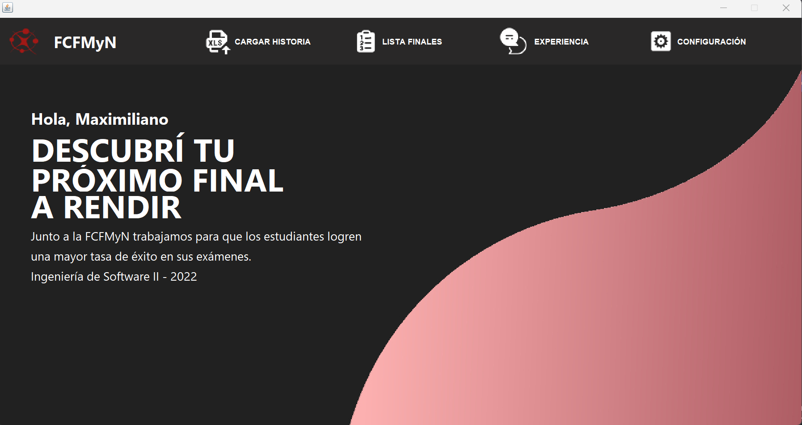
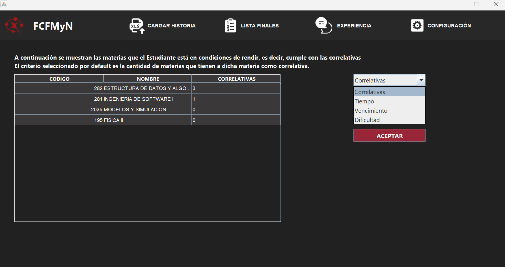
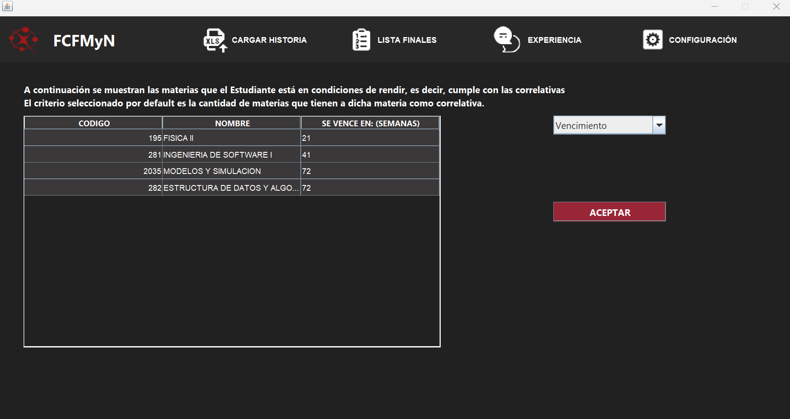

Sistema de asistencia universitaria

Objetivo: Asistir en la elección de los exámenes a rendir de los estudiantes de la FCFMyN. 

Cliente: UNSL.

Backend programado en Java, haciendo uso de patrones de diseño (Singleton, DAO, Facade). Persistencia de datos con Bases de datos Relacional (SQL)
Proyecto final de la materia Ingeniería de software II, UNSL.

